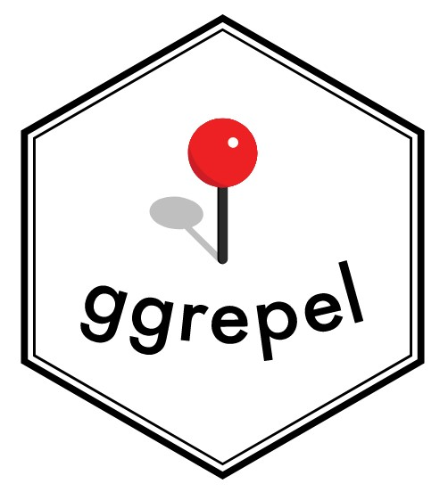

## 2.1 Learning Objectives

By the end of this exercise:

-   control the placement of annotation on a graph by using functions provided in ggrepel package

-   create professional publication quality figure by using functions provided in ggthemes and hrbrthemes packages

-   plot composite figure by combining ggplot2 graphs by using patchwork package

## 2.2 Getting started

### 2.2.1 Installing and loading the required libraries

Besides tidyverse, the following R packages will be used:

-   ggrepel: an R package provides geoms for ggplot2 to repel overlapping text labels

-   ggthemes: an R package provides some extra themes, geoms, and scales for ‘ggplot2’

-   hrbrthemes: an R package provides typography-centric themes and theme components for ggplot2

-   patchwork: an R package for preparing composite figure created using ggplot2

Code chunk below will be used to check if these packages have been installed and also will load them into the working R environment.

```{r}
pacman::p_load(ggrepel, patchwork, 
               ggthemes, hrbrthemes,
               tidyverse)
```

### 2.2.2 Importing data

The code chunk below imports *exam_data.csv* into R environment by using [*read_csv()*](https://readr.tidyverse.org/reference/read_delim.html) function of [**readr**](https://readr.tidyverse.org/) package and **readr** is one of the tidyverse package.

```{r}
exam_data <- read_csv("data/Exam_data.csv")
```

The data file *Exam_data* consists of year end examination grades of a cohort of primary 3 students from a local school in csv file format. There are a total of seven attributes in the exam_data tibble data frame. Four of them are categorical data type and the other three are in continuous data type.

-   The categorical attributes are: ID, CLASS, GENDER, RACE

-   The continuous attributes are: MATHS, ENGLISH, SCIENCE

### 2.3 Beyond ggplot2 Annotation: ggrepel {width="30" height="30"}

One of the challenge in plotting statistical graph is annotation, especially with large number of data points.

::: panel-tabset
### Plot

```{r}
#| echo: false
ggplot(data=exam_data, 
       aes(x= MATHS, 
           y=ENGLISH)) +
  geom_point() +
  geom_smooth(method=lm, 
              size=0.5) +  
  geom_label(aes(label = ID), 
             hjust = .5, 
             vjust = -.5) +
  coord_cartesian(xlim=c(0,100),
                  ylim=c(0,100)) +
  ggtitle("English scores versus Maths scores for Primary 3")
```

### Code

```{r}
#| eval: false
ggplot(data=exam_data, 
       aes(x= MATHS, 
           y=ENGLISH)) +
  geom_point() +
  geom_smooth(method=lm, 
              size=0.5) +  
  geom_label(aes(label = ID), 
             hjust = .5, 
             vjust = -.5) +
  coord_cartesian(xlim=c(0,100),
                  ylim=c(0,100)) +
  ggtitle("English scores versus Maths scores for Primary 3")
```
:::

[**ggrepel**](https://ggrepel.slowkow.com/) is an extension of **ggplot2** package which provides `geoms` for **ggplot2** to repel overlapping text. We simply replace `geom_text()` by [`geom_text_repel()`](https://ggrepel.slowkow.com/reference/geom_text_repel.html) and `geom_label()` by [`geom_label_repel`](https://ggrepel.slowkow.com/reference/geom_text_repel.html).

### 2.3.1 Working with ggrepel

::: panel-tabset
### Plot

```{r}
#| echo: false
ggplot(data=exam_data, 
       aes(x= MATHS, 
           y=ENGLISH)) +
  geom_point() +
  geom_smooth(method=lm, 
              size=0.5) +  
  geom_label_repel(aes(label = ID), 
                   fontface = "bold") +
  coord_cartesian(xlim=c(0,100),
                  ylim=c(0,100)) +
  ggtitle("English scores versus Maths scores for Primary 3")
```

### Code

```{r}
#| eval: false
ggplot(data=exam_data, 
       aes(x= MATHS, 
           y=ENGLISH)) +
  geom_point() +
  geom_smooth(method=lm, 
              size=0.5) +  
  geom_label_repel(aes(label = ID), 
                   fontface = "bold") +
  coord_cartesian(xlim=c(0,100),
                  ylim=c(0,100)) +
  ggtitle("English scores versus Maths scores for Primary 3")
```
:::

## 2.4 Beyond ggplot2 Themes

ggplot2 comes with eight [built-in themes](https://ggplot2.tidyverse.org/reference/ggtheme.html) - `theme_gray()`, `theme_bw()`, `theme_classic()`, `theme_dark()`, `theme_light()`, `theme_linedraw()`, `theme_minimal()`, `theme_void()`

::: panel-tabset
## Plot

```{r}
#| echo: false
ggplot(data=exam_data, 
             aes(x = MATHS)) +
  geom_histogram(bins=20, 
                 boundary = 100,
                 color="grey25", 
                 fill="grey90") +
  theme_gray() +
  ggtitle("Distribution of Maths scores")
```

## Code

```{r}
#| eval: false
ggplot(data=exam_data, 
             aes(x = MATHS)) +
  geom_histogram(bins=20, 
                 boundary = 100,
                 color="grey25", 
                 fill="grey90") +
  theme_gray() +
  ggtitle("Distribution of Maths scores")
```
:::

Refer to this [link](https://ggplot2.tidyverse.org/reference/index.html#themes) to learn more about ggplot2 `Themes`

### 2.4.1 Working with ggtheme package

[**ggthemes**](https://cran.r-project.org/web/packages/ggthemes/index.html) provides [‘ggplot2’ themes](https://yutannihilation.github.io/allYourFigureAreBelongToUs/ggthemes/) that replicate the look of plots by [Fivethirtyeight](https://fivethirtyeight.com/), [The Economist](https://www.economist.com/graphic-detail), [The Wall Street Journal](https://www.pinterest.com/wsjgraphics/wsj-graphics/) and among others.

The example below used *The Economist* theme.

::: panel-tabset
### Plot

```{r}
#| echo: false
ggplot(data=exam_data, 
             aes(x = MATHS)) +
  geom_histogram(bins=20, 
                 boundary = 100,
                 color="grey25", 
                 fill="grey90") +
  ggtitle("Distribution of Maths scores") +
  theme_economist()
```

### Code

```{r}
#| eval: false
ggplot(data=exam_data, 
             aes(x = MATHS)) +
  geom_histogram(bins=20, 
                 boundary = 100,
                 color="grey25", 
                 fill="grey90") +
  ggtitle("Distribution of Maths scores") +
  theme_economist()
```
:::

### 2.4.2 Working with hrbthems package

[**hrbrthemes**](https://cran.r-project.org/web/packages/hrbrthemes/index.html) package provides a base theme that focuses on typographic elements, including where various labels are placed as well as the fonts that are used.

::: panel-tabset
### Plot

```{r}
#| echo: false
ggplot(data=exam_data, 
             aes(x = MATHS)) +
  geom_histogram(bins=20, 
                 boundary = 100,
                 color="grey25", 
                 fill="grey90") +
  ggtitle("Distribution of Maths scores") +
  theme_ipsum()
```

### Code

```{r}
#| eval: false
ggplot(data=exam_data, 
             aes(x = MATHS)) +
  geom_histogram(bins=20, 
                 boundary = 100,
                 color="grey25", 
                 fill="grey90") +
  ggtitle("Distribution of Maths scores") +
  theme_ipsum()
```
:::

::: callout-note
The second goal centers around productivity for a production workflow. In fact, this “production workflow” is the context for where the elements of hrbrthemes should be used.
:::

::: panel-tabset
### Plot

```{r}
#| echo: false
ggplot(data=exam_data, 
             aes(x = MATHS)) +
  geom_histogram(bins=20, 
                 boundary = 100,
                 color="grey25", 
                 fill="grey90") +
  ggtitle("Distribution of Maths scores") +
  theme_ipsum(axis_title_size = 18,
              base_size = 15,
              grid = "Y")
```

### Code

```{r}
#| eval: false
ggplot(data=exam_data, 
             aes(x = MATHS)) +
  geom_histogram(bins=20, 
                 boundary = 100,
                 color="grey25", 
                 fill="grey90") +
  ggtitle("Distribution of Maths scores") +
  theme_ipsum(axis_title_size = 18,
              base_size = 15,
              grid = "Y")
```
:::

::: callout-tip
### What can we learn

-   `axis_title_size` argument is used to increase the font size of the axis title to 18,
-   `base_size` argument is used to increase the default axis label to 15, and
-   `grid` argument is used to remove the x-axis grid lines.
:::

## 2.5 Beyond Single Graph

It is not unusual that multiple graphs are required to tell a compelling visual story. There are several ggplot2 extensions provide functions to compose figure with multiple graphs. In this section, create composite plot by combining multiple graphs. First, create three statistical graphics by using the code chunk below.

**(1)**

::: panel-tabset
### Plot

```{r}
#| echo: false
p1 <- ggplot(data=exam_data, 
             aes(x = MATHS)) +
  geom_histogram(bins=20, 
                 boundary = 100,
                 color="grey25", 
                 fill="grey90") + 
  coord_cartesian(xlim=c(0,100)) +
  ggtitle("Distribution of Maths scores")
p1
```

### Code

```{r}
#| eval: false
p1 <- ggplot(data=exam_data, 
             aes(x = MATHS)) +
  geom_histogram(bins=20, 
                 boundary = 100,
                 color="grey25", 
                 fill="grey90") + 
  coord_cartesian(xlim=c(0,100)) +
  ggtitle("Distribution of Maths scores")
```
:::

**(2)**

::: panel-tabset
### Plot

```{r}
#| echo: false
p2 <- ggplot(data=exam_data, 
             aes(x = ENGLISH)) +
  geom_histogram(bins=20, 
                 boundary = 100,
                 color="grey25", 
                 fill="grey90") +
  coord_cartesian(xlim=c(0,100)) +
  ggtitle("Distribution of English scores")
p2
```

### Code

```{r}
#| eval: false
p2 <- ggplot(data=exam_data, 
             aes(x = ENGLISH)) +
  geom_histogram(bins=20, 
                 boundary = 100,
                 color="grey25", 
                 fill="grey90") +
  coord_cartesian(xlim=c(0,100)) +
  ggtitle("Distribution of English scores")
```
:::

**(3)**

::: panel-tabset
### Plot

```{r}
#| echo: false
p3 <- ggplot(data=exam_data, 
             aes(x= MATHS, 
                 y=ENGLISH)) +
  geom_point() +
  geom_smooth(method=lm, 
              size=0.5) +  
  coord_cartesian(xlim=c(0,100),
                  ylim=c(0,100)) +
  ggtitle("English scores versus Maths scores for Primary 3")
p3
```

### Code

```{r}
#| eval: false
p3 <- ggplot(data=exam_data, 
             aes(x= MATHS, 
                 y=ENGLISH)) +
  geom_point() +
  geom_smooth(method=lm, 
              size=0.5) +  
  coord_cartesian(xlim=c(0,100),
                  ylim=c(0,100)) +
  ggtitle("English scores versus Maths scores for Primary 3")
```
:::

### 2.5.1 Creating Composite Graphics: pathwork methods

There are several ggplot2 extension’s functions support the needs to prepare composite figure by combining several graphs such as [`grid.arrange()`](https://cran.r-project.org/web/packages/gridExtra/vignettes/arrangeGrob.html) of **gridExtra** package and [`plot_grid()`](https://wilkelab.org/cowplot/reference/plot_grid.html) of [**cowplot**](https://wilkelab.org/cowplot/index.html) package. In this section, a ggplot2 extension called [**patchwork**](https://patchwork.data-imaginist.com/) which is specially designed for combining separate ggplot2 graphs into a single figure.

Patchwork package has a very simple syntax where we can create layouts super easily. Here’s the general syntax that combines:

-   Two-Column Layout using the Plus Sign +

-   Parenthesis () to create a subplot group

-   Two-Row Layout using the Division Sign `/`

### 2.5.2 Combining two ggplot2 graphs

Figure in the tabset below shows a composite of two histograms created using patchwork. Note how simple the syntax used to create the plot!

::: panel-tabset
### Plot

```{r}
#| echo: false
p1 + p2
```

### Code

```{r}
#| eval: false
p1 + p2
```
:::

### 2.5.3 Combining three ggplot2 graphs

We can plot more complex composite by using appropriate operators. For example, the composite figure below is plotted by using:

-   “/” operator to stack two ggplot2 graphs

-   “\|” operator to place the plots beside each other

-   “()” operator the define the sequence of the plotting

::: panel-tabset
### Plot

```{r}
#| echo: false
(p1 / p2) | p3
```

### Code

```{r}
#| eval: false
(p1 / p2) | p3
```
:::

::: callout-tip
### To learn more

Refer to [Plot Assembly](https://patchwork.data-imaginist.com/articles/guides/assembly.html).
:::

### 2.5.4 Creating a composite figure with tag

In order to identify subplots in text, **patchwork** also provides auto-tagging capabilities as shown in the figure below.

::: panel-tabset
### Plot

```{r}
#| echo: false
((p1 / p2) | p3) + 
  plot_annotation(tag_levels = 'I')
```

### Code

```{r}
#| eval: false
((p1 / p2) | p3) + 
  plot_annotation(tag_levels = 'I')
```
:::

### 2.5.5 Creating figure with insert

Beside providing functions to place plots next to each other based on the provided layout. With [`inset_element()`](https://patchwork.data-imaginist.com/reference/inset_element.html) of **patchwork**, we can place one or several plots or graphic elements freely on top or below another plot.

::: panel-tabset
### Plot

```{r}
#| echo: false
p3 + inset_element(p2, 
                   left = 0.02, 
                   bottom = 0.7, 
                   right = 0.5, 
                   top = 1)
```

### Code

```{r}
#| eval: false
p3 + inset_element(p2, 
                   left = 0.02, 
                   bottom = 0.7, 
                   right = 0.5, 
                   top = 1)
```
:::

### 2.5.6 Creating a composite figure by using patchwork and ggtheme

Figure below is created by combining patchwork and theme_economist() of ggthemes package.

::: panel-tabset
### Plot

```{r}
#| echo: false
patchwork <- (p1 / p2) | p3
patchwork & theme_economist()
```

### Code

```{r}
#| eval: false
patchwork <- (p1 / p2) | p3
patchwork & theme_economist()
```
:::

### 2.6 Reference

-   [Patchwork R package goes nerd viral](https://www.littlemissdata.com/blog/patchwork)
-   [ggrepel](https://ggrepel.slowkow.com/)
-   [ggthemes](https://ggplot2.tidyverse.org/reference/ggtheme.html)
-   [hrbrthemes](https://cinc.rud.is/web/packages/hrbrthemes/)
-   [ggplot tips: Arranging plots](https://albert-rapp.de/post/2021-10-28-extend-plot-variety/)
-   [ggplot2 Theme Elements Demonstration](https://henrywang.nl/ggplot2-theme-elements-demonstration/)
-   [ggplot2 Theme Elements Reference Sheet](https://isabella-b.com/blog/ggplot2-theme-elements-reference/)
