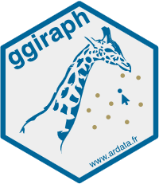

## Learning Outcome

Create interactive data visualisation by using functions provided by **ggiraph** and **plotlyr** packages.

## Installing and loading the required libraries

The following R packages will be used:

-   [**ggiraph**](https://davidgohel.github.io/ggiraph/) for making ‘ggplot’ graphics interactive.

-   [**plotly**](https://plotly.com/r/) R library for plotting interactive statistical graphs.

-   [**DT**](https://rstudio.github.io/DT/) provides an R interface to the JavaScript library [DataTables](https://datatables.net/) that create interactive table on html page.

-   [**tidyverse**](https://www.tidyverse.org/) a family of modern R packages specially designed to support data science, analysis and communication task including creating static statistical graphs.

-   [**patchwork**](https://patchwork.data-imaginist.com/) for combining multiple ggplot2 graphs into one figure.

</br> The code chunk below will be used:

```{r}
pacman::p_load(ggiraph, plotly, 
               patchwork, DT, tidyverse)
```

## Importing the data

The code chunk below [read_csv()](https://readr.tidyverse.org/reference/read_delim.html) of [**readr**](https://readr.tidyverse.org/) package is used to import Exam_data.csv data file into R and save it as an tibble data frame called `exam_data`.

```{r}
exam_data <- read_csv("data/Exam_data.csv")
```

## Interactive Data Visualisation - ggiraph {width="30" height="30"} methods

[ggiraph](https://davidgohel.github.io/ggiraph/) is a html widget and a ggplot2 extension. It allows ggplot graphics to be interactive.

Interactive elements are made possible with [**ggplot geometries**](https://davidgohel.github.io/ggiraph/reference/#section-interactive-geometries) that understands three arguments:

-   **Tooltip**: a column of data-sets that contain tooltips to be displayed when the mouse is over elements.

-   **Onclick**: a column of data-sets that contain a JavaScript function to be executed when elements are clicked.

-   **Data_id**: a column of data-sets that contain an id to be associated with elements.

### Tooltip effect with tooltip aesthetic

Below shows a code chunk to plot an interactive statistical graph by using **ggiraph** package.

::: callout-note
**By hovering the mouse pointer on a data point of interest, the student’s ID will be displayed.**
:::

::: panel-tabset
### Plot

```{r}
#| echo: false
p <- ggplot(data=exam_data, 
       aes(x = MATHS)) +
  geom_dotplot_interactive(
    aes(tooltip = ID),
    stackgroups = TRUE, 
    binwidth = 1, 
    method = "histodot") +
  scale_y_continuous(NULL, 
                     breaks = NULL)
girafe(
  ggobj = p,
  width_svg = 6,
  height_svg = 6*0.618
)
```

### Code

```{r}
#| eval: false
p <- ggplot(data=exam_data, 
       aes(x = MATHS)) +
  geom_dotplot_interactive(
    aes(tooltip = ID),
    stackgroups = TRUE, 
    binwidth = 1, 
    method = "histodot") +
  scale_y_continuous(NULL, 
                     breaks = NULL)
girafe(
  ggobj = p,
  width_svg = 6,
  height_svg = 6*0.618
)
```
:::

First, an interactive version of ggplot2 geom, [`geom_dotplot_interactive()`](https://davidgohel.github.io/ggiraph/reference/geom_dotplot_interactive.html) will be used to create the basic graph. Then, [`girafe()`](https://davidgohel.github.io/ggiraph/reference/girafe.html) will be used to generate a svg object to be displayed on an html page.

### Displaying multiple information on tooltip

The first three lines of codes in the code chunk create a new field called tooltip. At the same time, it populates text in ID and CLASS fields into the newly created field. Next, this newly created field is used as tooltip field as shown in the code of line 7.

::: callout-note
**By hovering the mouse pointer on an data point of interest, the student’s ID and Class will be displayed.**
:::

::: panel-tabset
### Plot

```{r}
#| echo: false
exam_data$tooltip <- c(paste0(     
  "Name = ", exam_data$ID,         
  "\n Class = ", exam_data$CLASS)) 

p <- ggplot(data=exam_data, 
       aes(x = MATHS)) +
  geom_dotplot_interactive(
    aes(tooltip = exam_data$tooltip), 
    stackgroups = TRUE,
    binwidth = 1,
    method = "histodot") +
  scale_y_continuous(NULL,               
                     breaks = NULL)
girafe(
  ggobj = p,
  width_svg = 8,
  height_svg = 8*0.618
)
```

### Code

```{r}
#| eval: false
exam_data$tooltip <- c(paste0(     
  "Name = ", exam_data$ID,         
  "\n Class = ", exam_data$CLASS)) 

p <- ggplot(data=exam_data, 
       aes(x = MATHS)) +
  geom_dotplot_interactive(
    aes(tooltip = exam_data$tooltip), 
    stackgroups = TRUE,
    binwidth = 1,
    method = "histodot") +
  scale_y_continuous(NULL,               
                     breaks = NULL)
girafe(
  ggobj = p,
  width_svg = 8,
  height_svg = 8*0.618
)
```
:::

### Customising Tooltip style

Code chunk below uses [`opts_tooltip()`](https://davidgohel.github.io/ggiraph/reference/opts_tooltip.html) of **ggiraph** to customize tooltip rendering by add css declarations.

::: callout-note
**Notice that the background colour of the tooltip is black and the font colour is white and bold.**
:::

::: panel-tabset
### Plot

```{r}
#| echo: false
tooltip_css <- "background-color:white; #<<
font-style:bold; color:black;" #<<

p <- ggplot(data=exam_data, 
       aes(x = MATHS)) +
  geom_dotplot_interactive(              
    aes(tooltip = ID),                   
    stackgroups = TRUE,                  
    binwidth = 1,                        
    method = "histodot") +               
  scale_y_continuous(NULL,               
                     breaks = NULL)
girafe(                                  
  ggobj = p,                             
  width_svg = 6,                         
  height_svg = 6*0.618,
  options = list(    #<<
    opts_tooltip(    #<<
      css = tooltip_css)) #<<
)                                        
```

### Code

```{r}
#| eval: false
tooltip_css <- "background-color:white; #<<
font-style:bold; color:black;" #<<

p <- ggplot(data=exam_data, 
       aes(x = MATHS)) +
  geom_dotplot_interactive(              
    aes(tooltip = ID),                   
    stackgroups = TRUE,                  
    binwidth = 1,                        
    method = "histodot") +               
  scale_y_continuous(NULL,               
                     breaks = NULL)
girafe(                                  
  ggobj = p,                             
  width_svg = 6,                         
  height_svg = 6*0.618,
  options = list(    #<<
    opts_tooltip(    #<<
      css = tooltip_css)) #<<
)                                        
```
:::

::: callout-tip
For more customisations, [Customizing girafe objects](https://www.ardata.fr/ggiraph-book/customize.html)
:::

### Displaying statistics on tooltip

Code chunk below shows an advanced way to customise tooltip. In this example, a function is used to compute 90% confident interval of the mean. The derived statistics are then displayed in the tooltip.

::: panel-tabset
### Plot

```{r}
#| echo: false
tooltip <- function(y, ymax, accuracy = .01) {
  mean <- scales::number(y, accuracy = accuracy)
  sem <- scales::number(ymax - y, accuracy = accuracy)
  paste("Mean maths scores:", mean, "+/-", sem)
}

gg_point <- ggplot(data=exam_data, 
                   aes(x = RACE),
) +
  stat_summary(aes(y = MATHS, 
                   tooltip = after_stat(  
                     tooltip(y, ymax))),  
    fun.data = "mean_se", 
    geom = GeomInteractiveCol,  
    fill = "light blue"
  ) +
  stat_summary(aes(y = MATHS),
    fun.data = mean_se,
    geom = "errorbar", width = 0.2, size = 0.2
  )

girafe(ggobj = gg_point,
       width_svg = 8,
       height_svg = 8*0.618)
```

### Code

```{r}
#| eval: false
tooltip <- function(y, ymax, accuracy = .01) {
  mean <- scales::number(y, accuracy = accuracy)
  sem <- scales::number(ymax - y, accuracy = accuracy)
  paste("Mean maths scores:", mean, "+/-", sem)
}

gg_point <- ggplot(data=exam_data, 
                   aes(x = RACE),
) +
  stat_summary(aes(y = MATHS, 
                   tooltip = after_stat(  
                     tooltip(y, ymax))),  
    fun.data = "mean_se", 
    geom = GeomInteractiveCol,  
    fill = "light blue"
  ) +
  stat_summary(aes(y = MATHS),
    fun.data = mean_se,
    geom = "errorbar", width = 0.2, size = 0.2
  )

girafe(ggobj = gg_point,
       width_svg = 8,
       height_svg = 8*0.618)                                       
```
:::

### Hover effect with data_id aesthetic

Code chunk below shows the second interactive feature of ggiraph, namely `data_id`.

Elements associated with a *data_id* (i.e CLASS) will be highlighted upon mouse over.

::: panel-tabset
### Plot

```{r}
#| echo: false
p <- ggplot(data=exam_data, 
       aes(x = MATHS)) +
  geom_dotplot_interactive(           
    aes(data_id = CLASS),             
    stackgroups = TRUE,               
    binwidth = 1,                        
    method = "histodot") +               
  scale_y_continuous(NULL,               
                     breaks = NULL)
girafe(                                  
  ggobj = p,                             
  width_svg = 6,                         
  height_svg = 6*0.618                      
)
```

### Code

```{r}
#| eval: false
p <- ggplot(data=exam_data, 
       aes(x = MATHS)) +
  geom_dotplot_interactive(           
    aes(data_id = CLASS),             
    stackgroups = TRUE,               
    binwidth = 1,                        
    method = "histodot") +               
  scale_y_continuous(NULL,               
                     breaks = NULL)
girafe(                                  
  ggobj = p,                             
  width_svg = 6,                         
  height_svg = 6*0.618                      
)
```
:::

::: callout-note
The default value of the hover css is hover_css = “fill:orange;”.
:::

### Styling hover effect

In the code chunk below, css codes are used to change the highlighting effect.

Elements associated with a *data_id* (i.e CLASS) will be highlighted upon mouse over.

::: panel-tabset
### Plot

```{r}
#| echo: false
p <- ggplot(data=exam_data, 
       aes(x = MATHS)) +
  geom_dotplot_interactive(              
    aes(data_id = CLASS),              
    stackgroups = TRUE,                  
    binwidth = 1,                        
    method = "histodot") +               
  scale_y_continuous(NULL,               
                     breaks = NULL)
girafe(                                  
  ggobj = p,                             
  width_svg = 6,                         
  height_svg = 6*0.618,
  options = list(                        
    opts_hover(css = "fill: #202020;"),  
    opts_hover_inv(css = "opacity:0.2;") 
  )                                        
)                                        
```

### Code

```{r}
#| eval: false
p <- ggplot(data=exam_data, 
       aes(x = MATHS)) +
  geom_dotplot_interactive(              
    aes(data_id = CLASS),              
    stackgroups = TRUE,                  
    binwidth = 1,                        
    method = "histodot") +               
  scale_y_continuous(NULL,               
                     breaks = NULL)
girafe(                                  
  ggobj = p,                             
  width_svg = 6,                         
  height_svg = 6*0.618,
  options = list(                        
    opts_hover(css = "fill: #202020;"),  
    opts_hover_inv(css = "opacity:0.2;") 
  )                                        
)                                        
```
:::

::: callout-note
In this example the ccs customisation request are encoded directly.
:::

### Combining tooltip and hover effect

In the code chunk below, tooltip and hover effects are combined in the interactive statistical graph.

Elements associated with a *data_id* (i.e CLASS) will be highlighted upon mouse over. At the same time, the tooltip will show the CLASS.

::: panel-tabset
### Plot

```{r}
#| echo: false
p <- ggplot(data=exam_data, 
       aes(x = MATHS)) +
  geom_dotplot_interactive(              
    aes(tooltip = CLASS, 
        data_id = CLASS),              
    stackgroups = TRUE,                  
    binwidth = 1,                        
    method = "histodot") +               
  scale_y_continuous(NULL,               
                     breaks = NULL)
girafe(                                  
  ggobj = p,                             
  width_svg = 6,                         
  height_svg = 6*0.618,
  options = list(                        
    opts_hover(css = "fill: #202020;"),  
    opts_hover_inv(css = "opacity:0.2;") 
  )                                        
)                                        
```

### Code

```{r}
#| eval: false
p <- ggplot(data=exam_data, 
       aes(x = MATHS)) +
  geom_dotplot_interactive(              
    aes(tooltip = CLASS, 
        data_id = CLASS),              
    stackgroups = TRUE,                  
    binwidth = 1,                        
    method = "histodot") +               
  scale_y_continuous(NULL,               
                     breaks = NULL)
girafe(                                  
  ggobj = p,                             
  width_svg = 6,                         
  height_svg = 6*0.618,
  options = list(                        
    opts_hover(css = "fill: #202020;"),  
    opts_hover_inv(css = "opacity:0.2;") 
  )                                        
)                                        
```
:::

### Click effect with onclick

`onclick` argument of ggiraph provides hotlink interactivity on the web.

Web document link with a data object will be displayed on the web browser upon mouse click.

The code chunk below shown an example of `onclick`.

::: panel-tabset
### Plot

```{r}
#| echo: false
exam_data$onclick <- sprintf("window.open(\"%s%s\")",
"https://www.moe.gov.sg/schoolfinder?journey=Primary%20school",
as.character(exam_data$ID))

p <- ggplot(data=exam_data, 
       aes(x = MATHS)) +
  geom_dotplot_interactive(              
    aes(onclick = onclick),              
    stackgroups = TRUE,                  
    binwidth = 1,                        
    method = "histodot") +               
  scale_y_continuous(NULL,               
                     breaks = NULL)
girafe(                                  
  ggobj = p,                             
  width_svg = 6,                         
  height_svg = 6*0.618)                                        
```

### Code

```{r}
#| eval: false
exam_data$onclick <- sprintf("window.open(\"%s%s\")",
"https://www.moe.gov.sg/schoolfinder?journey=Primary%20school",
as.character(exam_data$ID))

p <- ggplot(data=exam_data, 
       aes(x = MATHS)) +
  geom_dotplot_interactive(              
    aes(onclick = onclick),              
    stackgroups = TRUE,                  
    binwidth = 1,                        
    method = "histodot") +               
  scale_y_continuous(NULL,               
                     breaks = NULL)
girafe(                                  
  ggobj = p,                             
  width_svg = 6,                         
  height_svg = 6*0.618)                                        
```
:::

::: callout-caution
Click actions must be a string column in the dataset containing valid javascript instructions.
:::

### Coordinated Multiple Views with ggiraph

When a data point of one of the dotplot is selected, the corresponding data point ID on the second data visualisation will be highlighted too.

In order to build a coordinated multiple views, thse following programming strategy will be used:

1.  Appropriate interactive functions of **ggiraph** will be used to create the multiple views.

2.  *patchwork* function of [patchwork](https://patchwork.data-imaginist.com/) package will be used inside girafe function to create the interactive coordinated multiple views.

The *data_id* aesthetic is critical to link observations between plots and the tooltip aesthetic is optional but nice to have when mouse over a point.

::: panel-tabset
### Plot

```{r}
#| echo: false
p1 <- ggplot(data=exam_data, 
       aes(x = MATHS)) +
  geom_dotplot_interactive(              
    aes(data_id = ID),              
    stackgroups = TRUE,                  
    binwidth = 1,                        
    method = "histodot") +  
  coord_cartesian(xlim=c(0,100)) + 
  scale_y_continuous(NULL,               
                     breaks = NULL)

p2 <- ggplot(data=exam_data, 
       aes(x = ENGLISH)) +
  geom_dotplot_interactive(              
    aes(data_id = ID),              
    stackgroups = TRUE,                  
    binwidth = 1,                        
    method = "histodot") + 
  coord_cartesian(xlim=c(0,100)) + 
  scale_y_continuous(NULL,               
                     breaks = NULL)

girafe(code = print(p1 + p2), 
       width_svg = 6,
       height_svg = 3,
       options = list(
         opts_hover(css = "fill: #202020;"),
         opts_hover_inv(css = "opacity:0.2;")
         )
       ) 
```

### Code

```{r}
#| eval: false
p1 <- ggplot(data=exam_data, 
       aes(x = MATHS)) +
  geom_dotplot_interactive(              
    aes(data_id = ID),              
    stackgroups = TRUE,                  
    binwidth = 1,                        
    method = "histodot") +  
  coord_cartesian(xlim=c(0,100)) + 
  scale_y_continuous(NULL,               
                     breaks = NULL)

p2 <- ggplot(data=exam_data, 
       aes(x = ENGLISH)) +
  geom_dotplot_interactive(              
    aes(data_id = ID),              
    stackgroups = TRUE,                  
    binwidth = 1,                        
    method = "histodot") + 
  coord_cartesian(xlim=c(0,100)) + 
  scale_y_continuous(NULL,               
                     breaks = NULL)

girafe(code = print(p1 + p2), 
       width_svg = 6,
       height_svg = 3,
       options = list(
         opts_hover(css = "fill: #202020;"),
         opts_hover_inv(css = "opacity:0.2;")
         )
       ) 
```
:::

## Interactive Data Visualisation - plotly methods

Plotly’s R graphing library create interactive web graphics from **ggplot2** graphs and/or a custom interface to the (MIT-licensed) JavaScript library [**plotly.js**](https://plotly.com/javascript/) inspired by the grammar of graphics. Different from other plotly platform, plot.R is free and open source.


There are two ways to create interactive graph by using plotly, they are:

-   by using *plot_ly()* and

-   by using *ggplotly()*

### Creating an interactive scatter plot: plot_ly() method

The code chunk below shows a basic interactive plot created by using *plot_ly()*.

::: panel-tabset
### Plot

```{r}
#| echo: false
plot_ly(data = exam_data, 
             x = ~MATHS, 
             y = ~ENGLISH)
```

### Code

```{r}
#| eval: false
plot_ly(data = exam_data, 
             x = ~MATHS, 
             y = ~ENGLISH)
```
:::

### Working with visual variable: plot_ly() method

In the code chunk below, *color* argument is mapped to a qualitative visual variable (i.e. RACE).

:::: panel-tabset
### Plot

```{r}
#| echo: false
plot_ly(data = exam_data, 
        x = ~ENGLISH, 
        y = ~MATHS, 
        color = ~RACE)
```

::: callout-note
Click on the colour symbol at the legend.
:::

### Code

```{r}
#| eval: false
plot_ly(data = exam_data, 
        x = ~ENGLISH, 
        y = ~MATHS, 
        color = ~RACE)
```
::::

### Creating an interactive scatter plot: ggplotly() method

The code chunk below plots an interactive scatter plot by using ggplotly().

:::: panel-tabset
### Plot

```{r}
#| echo: false
p <- ggplot(data=exam_data, 
            aes(x = MATHS,
                y = ENGLISH)) +
  geom_point(size=1) +
  coord_cartesian(xlim=c(0,100),
                  ylim=c(0,100))
ggplotly(p)
```

### Code

```{r}
#| eval: false
p <- ggplot(data=exam_data, 
            aes(x = MATHS,
                y = ENGLISH)) +
  geom_point(size=1) +
  coord_cartesian(xlim=c(0,100),
                  ylim=c(0,100))
ggplotly(p)
```

::: callout-note
The only extra line to include in the code chunk is ggplotly().
:::
::::

### Coordinated Multiple Views with plotly

The creation of a coordinated linked plot by using plotly involves three steps:

-   [`highlight_key()`](https://www.rdocumentation.org/packages/plotly/versions/4.9.2/topics/highlight_key) of **plotly** package is used as shared data.

-   two scatterplots will be created by using ggplot2 functions.

-   lastly, [*subplot()*](https://plotly.com/r/subplots/) of **plotly** package is used to place them next to each other side-by-side.

:::: panel-tabset
### Plot

```{r}
#| echo: false
d <- highlight_key(exam_data)
p1 <- ggplot(data=d, 
            aes(x = MATHS,
                y = ENGLISH)) +
  geom_point(size=1) +
  coord_cartesian(xlim=c(0,100),
                  ylim=c(0,100))

p2 <- ggplot(data=d, 
            aes(x = MATHS,
                y = SCIENCE)) +
  geom_point(size=1) +
  coord_cartesian(xlim=c(0,100),
                  ylim=c(0,100))
subplot(ggplotly(p1),
        ggplotly(p2))
```

::: callout-note
Click on a data point of one of the scatterplot and see how the corresponding point on the other scatterplot is selected.
:::

### Code

```{r}
#| eval: false
d <- highlight_key(exam_data)
p1 <- ggplot(data=d, 
            aes(x = MATHS,
                y = ENGLISH)) +
  geom_point(size=1) +
  coord_cartesian(xlim=c(0,100),
                  ylim=c(0,100))

p2 <- ggplot(data=d, 
            aes(x = MATHS,
                y = SCIENCE)) +
  geom_point(size=1) +
  coord_cartesian(xlim=c(0,100),
                  ylim=c(0,100))
subplot(ggplotly(p1),
        ggplotly(p2))
```
::::

Thing to learn from the code chunk:

-   `highlight_key()` simply creates an object of class [crosstalk::SharedData](https://rdrr.io/cran/crosstalk/man/SharedData.html).

## Interactive Data Visualisation - crosstalk methods

[Crosstalk](https://rstudio.github.io/crosstalk/index.html) is an add-on to the htmlwidgets package. It extends htmlwidgets with a set of classes, functions, and conventions for implementing cross-widget interactions (currently, linked brushing and filtering).

### Interactive Data Table: DT package

-   A wrapper of the JavaScript Library [DataTables](https://datatables.net/)

-   Data objects in R can be rendered as HTML tables using the JavaScript library ‘DataTables’ (typically via R Markdown or Shiny).

```{r}
DT::datatable(exam_data, class= "compact")
```

### Linked brushing: crosstalk method

Code chunk below is used to implement coordinated brushing.

::: panel-tabset
### Plot

```{r}
#| echo: false
d <- highlight_key(exam_data) 
p <- ggplot(d, 
            aes(ENGLISH, 
                MATHS)) + 
  geom_point(size=1) +
  coord_cartesian(xlim=c(0,100),
                  ylim=c(0,100))

gg <- highlight(ggplotly(p),        
                "plotly_selected")  

crosstalk::bscols(gg,               
                  DT::datatable(d), 
                  widths = 5)        
```

### Code

```{r}
#| eval: false
d <- highlight_key(exam_data) 
p <- ggplot(d, 
            aes(ENGLISH, 
                MATHS)) + 
  geom_point(size=1) +
  coord_cartesian(xlim=c(0,100),
                  ylim=c(0,100))

gg <- highlight(ggplotly(p),        
                "plotly_selected")  

crosstalk::bscols(gg,               
                  DT::datatable(d), 
                  widths = 5)        
```
:::

Things to learn from the code chunk:

-   *highlight()* is a function of **plotly** package. It sets a variety of options for brushing (i.e., highlighting) multiple plots. These options are primarily designed for linking multiple plotly graphs, and may not behave as expected when linking plotly to another htmlwidget package via crosstalk. In some cases, other htmlwidgets will respect these options, such as persistent selection in leaflet.

-   *bscols()* is a helper function of **crosstalk** package. It makes it easy to put HTML elements side by side. It can be called directly from the console but is especially designed to work in an R Markdown document. **Warning:** This will bring in all of Bootstrap.
