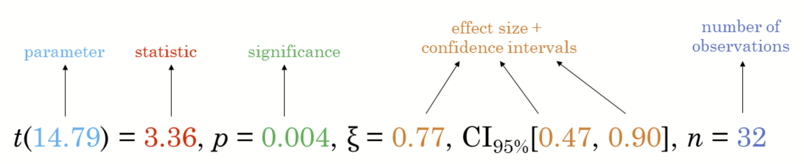
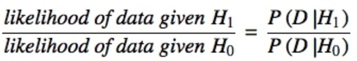

## Learning Outcome

Gain hands-on experience on using:

-   ggstatsplot package to create visual graphics with rich statistical information

-   performance package to visualise model diagnostics

-   parameters package to visualise model parameters

## Getting Started

[**ggstatsplot**](https://indrajeetpatil.github.io/ggstatsplot/) is an extension of [**ggplot2**](https://ggplot2.tidyverse.org/) package for creating graphics with details from statistical tests included in the information-rich plots themselves.

-   To provide alternative statistical inference methods by default

-   To follow besst practices for statistical reporting

-   For all statistical tests resulted in the plots, the default template abides by the [APA gold standard](https://my.ilstu.edu/~jhkahn/apastats.html) for statistical reporting

For example, here are results from a robust t-test:



## Installing and loading the required libraries

The following R packages will be used:

-   ggstatsplotis an extension of ggplot2 package for creating graphics with details from statstical tests included in the plots themselces

-   tidyverse, a family of modern R packages specially designed to support data science, analysis and communication task including creating static statistical graphs.

The code chunk below will be used:

```{r}
pacman::p_load(ggstatsplot, tidyverse)
```

## Importing the data

The code chunk below [read_csv()](https://readr.tidyverse.org/reference/read_delim.html) of [**readr**](https://readr.tidyverse.org/) package is used to import Exam_data.csv data file into R and save it as an tibble data frame called `exam`.

```{r}
exam <- read_csv("data/Exam_data.csv")
```

## One-sample test: *gghistostats()* method

In the code chunk below, [*gghistostats()*](https://indrajeetpatil.github.io/ggstatsplot/reference/gghistostats.html) is used to to build an visual of one-sample test on English scores.

::: panel-tabset
### Plot

```{r}
#| echo: false
set.seed(1234)

gghistostats(
  data = exam,
  x = ENGLISH,
  type = "bayes",
  test.value = 60,
  xlab = "English scores"
)
```

### Code

```{r}
#| eval: false
set.seed(1234)

gghistostats(
  data = exam,
  x = ENGLISH,
  type = "bayes",
  test.value = 60,
  xlab = "English scores"
)
```
:::

Default information: - statistical details - Bayes Factor - sample sizes - distribution summary

## Unpacking the Bayes Factor

-   Bayes factor is the ratio of the likelihood of one particular hypothesis to the likelihood of another. It can be interpreted as a measure of the strength of evidence in favor of one theory among two competing theories.

-   Bayes factor gives us a way to evaluate the data in favor of a null hypothesis, and to use external information to do so. It tells us what the weight of the evidence is in favor of a given hypothesis.

-   When comparing two hypotheses, H1 (the alternate hypothesis) and H0 (the null hypothesis), the Bayes Factor is often written as B10. It can be defined mathematically as

{width="300"}

-   The [**Schwarz criterion**](https://www.statisticshowto.com/bayesian-information-criterion/) is one of the easiest ways to calculate rough approximation of the Bayes Factor.

## How to interpret Bayes Factor

**Bayes Factor** can be any positive number. A common interpretation was first proposed by Harold Jeffereys (1961) and slightly modified by [Lee and Wagenmakers](https://www-tandfonline-com.libproxy.smu.edu.sg/doi/pdf/10.1080/00031305.1999.10474443?needAccess=true) in 2013:

| B10 Value  |          Conclusion           |
|:----------:|:-----------------------------:|
|   \>100    |   Extreme evidence for H~1~   |
|   30-100   | Very strong evidence for H~1~ |
|   10-30    |   Strong evidence for H~1~    |
|    3-10    |  Moderate evidence for H~1~   |
|    1-3     |  Anecdotal evidence for H~1~  |
|     1      |          No evidence          |
|   1/3-1    |  Anecdotal evidence for H~1~  |
|  1/3-1/10  |  Moderate evidence for H~1~   |
| 1/10-1/30  |   Strong evidence for H~1~    |
| 1/30-1/100 | Very strong evidence for H~1~ |
|  \<1/100   |   Extreme evidence for H~1~   |

## Two-sample mean test: *ggbetweenstats()*

In the code chunk below, [*ggbetweenstats()*](https://indrajeetpatil.github.io/ggstatsplot/reference/ggbetweenstats.html) is used to build a visual for two-sample mean test of Maths scores by gender.

::: panel-tabset
### Plot

```{r}
#| echo: false
ggbetweenstats(
  data = exam,
  x = GENDER, 
  y = MATHS,
  type = "np",
  messages = FALSE
)
```

### Code

```{r}
#| eval: false
ggbetweenstats(
  data = exam,
  x = GENDER, 
  y = MATHS,
  type = "np",
  messages = FALSE
)
```
:::

Default information: - statistical details - Bayes Factor - sample sizes - distribution summary

### Oneway ANOVA Test: *ggbetweenstats()* method

In the code chunk below, [*ggbetweenstats()*](https://indrajeetpatil.github.io/ggstatsplot/reference/ggbetweenstats.html) is used to build a visual for One-way ANOVA test on English score by race.

::: panel-tabset
### Plot

```{r}
#| echo: false
ggbetweenstats(
  data = exam,
  x = RACE, 
  y = ENGLISH,
  type = "p",
  mean.ci = TRUE, 
  pairwise.comparisons = TRUE, 
  pairwise.display = "s",
  p.adjust.method = "fdr",
  messages = FALSE
)
```

### Code

```{r}
#| eval: false
ggbetweenstats(
  data = exam,
  x = RACE, 
  y = ENGLISH,
  type = "p",
  mean.ci = TRUE, 
  pairwise.comparisons = TRUE, 
  pairwise.display = "s",
  p.adjust.method = "fdr",
  messages = FALSE
)
```
:::

-   “ns” → only non-significant
-   “s” → only significant
-   “all” → everything

## ggbetweenstats - Summary of tests

Following (between-subjects) tests are carried out for each type of analyses:

| Type | No. of groups | Test |
|:----------------:|:----------------:|:-----------------------------------:|
| Parametric | \>2 | Fisher’s or Welch’s one-way ANOVA |
| Non-parametric | \>2 | Kruskal-Wallis one-way ANOVA |
| Robust | \>2 | Heteroscedastic one-way ANOVA for trimmed means |
| Bayes Factor | \>2 | Fisher’s ANOVA |
| Parametric | 2 | Student’s or Welch’s t-test |
| Non-parametric | 2 | Mann-Whitney U test |
| Robust | 2 | Yuen’s test for trimmed means |
| Bayes Factor | 2 | Student’s t-test |

Following effect sizes (and confidence intervals) are available for each type of test:

| Type | No. of Groups | Effect Size | Confidence Intervals |
|:---------------:|:---------------:|:-------------------:|:---------------:|
| Parametric | \>2 |  | Yes |
| Non-parametric | \>2 | (H-statistic based eta-squared) | Yes |
| Robust | \>2 | (Explanatory measure of effect size) | Yes |
| Bayes Factor | \>2 | No | No |
| Parametric | 2 | Cohen’s *d*, Hedge’s *g* (central-and-noncentral-t distribution based) | Yes |
| Non-parametric | 2 | r (computed as ) | Yes |
| Robust | 2 | (Explanatory measure of effect size) | Yes |
| Bayes Factor | 2 | No | No |

Summary of pairwise comparison tests supported in *ggbetweenstats*

|      Type      | Equal Variance |           Test            | p-value Adjustment? |
|:----------------:|:----------------:|:-----------------:|:----------------:|
|   Parametric   |       No       |     Games Howell Test     |         Yes         |
|   Parametric   |      Yes       |     Student’s t Test      |         Yes         |
| Non-Parametric |       No       |         Dunn Test         |         Yes         |
|     Robust     |       No       | Yuen’s Trimmed Means Test |         Yes         |
|  Bayes Factor  |       NA       |     Student’s t Test      |         NA          |

## Significant Test of Correlation: *ggscatterstats()*

In the code chunk below, [*ggscatterstats()*](https://indrajeetpatil.github.io/ggstatsplot/reference/ggscatterstats.html) is used to build a visual for Significant Test of Correlation between Maths scores and English scores.

::: panel-tabset
### Plot

```{r}
#| echo: false
ggscatterstats(
  data = exam,
  x = MATHS,
  y = ENGLISH,
  marginal = FALSE,
  )
```

### Code

```{r}
#| eval: false
ggscatterstats(
  data = exam,
  x = MATHS,
  y = ENGLISH,
  marginal = FALSE,
  )
```
:::

## Significant Test of Association (Depedence) : *ggbarstats()* methods

In the code chunk below, the Maths scores is binned into a 4-class variable by using [*cut()*](https://www.rdocumentation.org/packages/base/versions/3.6.2/topics/cut).

[*ggbarstats()*](https://indrajeetpatil.github.io/ggstatsplot/reference/ggbarstats.html) is used to build a visual for Significant Test of Association.

::: panel-tabset
### Plot

```{r}
#| echo: false
exam1 <- exam %>% 
  mutate(MATHS_bins = 
           cut(MATHS, 
               breaks = c(0,60,75,85,100))
)

ggbarstats(exam1, 
           x = MATHS_bins, 
           y = GENDER)                                  
```

### Code

```{r}
#| eval: false
exam1 <- exam %>% 
  mutate(MATHS_bins = 
           cut(MATHS, 
               breaks = c(0,60,75,85,100))
)

ggbarstats(exam1, 
           x = MATHS_bins, 
           y = GENDER)                                  
```
:::