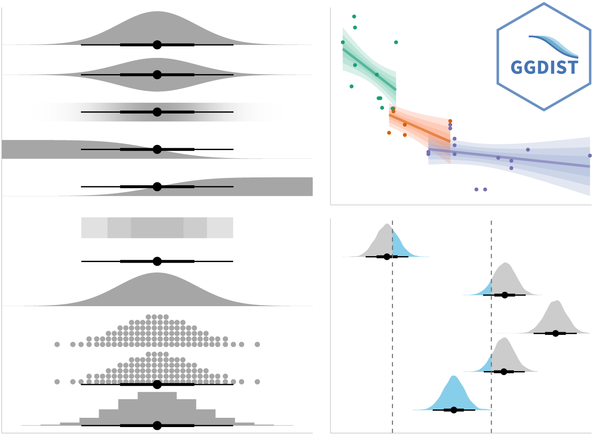

## Learning Outcome

-   Plot statistics error bars by using ggplot2

-   Plot interactive error bars by combining ggplot2, plotly and DT

-   Create advanced by using ggdist

-   Create hypothetical outcome plots (HOPs) by using ungeviz package

## Installing and loading the required libraries

The following R packages will be used:

-   tidyverse, a family of R packages for data science process

-   plotly for creating interactive plot

-   gganimate for creating animation plot

-   DT for displaying interactive html table

-   crosstalk for for implementing cross-widget interactions (currently, linked brushing and filtering)

-   ggdist for visualising distribution and uncertainty

```{r}
pacman::p_load(plotly, crosstalk, DT, 
               ggdist, ggridges, colorspace,
               gganimate, tidyverse)
```

## Importing the data

Import Exam_data.csv data file into R and save it as an tibble data frame called `exam`.

```{r}
exam <- read_csv("data/Exam_data.csv")
```

## Visualizing the uncertainty of point estimates: ggplot2 methods

A point estimate is a single number, such as a mean. Uncertainty, on the other hand, is expressed as standard error, confidence interval, or credible interval.

How to plot error bars of maths scores by race by using data provided in exam tibble data frame.

Firstly, code chunk below will be used to derive the necessary summary statistics.

```{r}
my_sum <- exam %>%
  group_by(RACE) %>%
  summarise(
    n=n(),
    mean=mean(MATHS),
    sd=sd(MATHS)
    ) %>%
  mutate(se=sd/sqrt(n-1))
```

Next, the code chunk below will be used to display *my_sum* tibble data frame in an html table format.

```{r}
knitr::kable(head(my_sum), format = 'html')
```

::: callout-important
Do not confuse the uncertainty of a point estimate with the variation in the sample
:::

::: {.callout-tip title="Things to learn"}
-   `group_by()` of **dplyr** package is used to group the observation by RACE,
-   `summarise()` is used to compute the count of observations, mean, standard deviation
-   `mutate()` is used to derive standard error of Maths by RACE, and
-   the output is save as a tibble data table called *my_sum*.
:::

::: callout-note
For the mathematical explanation, please refer to Slide 20 of Lesson 4.
:::

## Plotting standard error bars of point estimates

The code chunk below plots the standard error bars of mean maths score by race.

Note:

-   The error bars are computed by using the formula mean+/-se
-   For `geom_point()` it is important to indicate *stat=“identity”*

::: panel-tabset
### Plot

```{r}
#| echo: false
ggplot(my_sum) +
  geom_errorbar(
    aes(x=RACE, 
        ymin=mean-se, 
        ymax=mean+se), 
    width=0.2, 
    colour="black", 
    alpha=0.9, 
    linewidth=0.5) +
  geom_point(aes
           (x=RACE, 
            y=mean), 
           stat="identity", 
           color="red",
           size = 1.5,
           alpha=1) +
  ggtitle("Standard error of mean maths score by rac")
```

### Code

```{r}
#| eval: false
ggplot(my_sum) +
  geom_errorbar(
    aes(x=RACE, 
        ymin=mean-se, 
        ymax=mean+se), 
    width=0.2, 
    colour="black", 
    alpha=0.9, 
    linewidth=0.5) +
  geom_point(aes
           (x=RACE, 
            y=mean), 
           stat="identity", 
           color="red",
           size = 1.5,
           alpha=1) +
  ggtitle("Standard error of mean maths score by rac")
```
:::

## Plotting confidence interval of point estimates

Instead of plotting the standard error bar of point estimates, the confidence intervals of mean maths score by race can also be plotted.

Note:

-   The confidence intervals are computed by using the formula mean+/-1.96\*se
-   The error bars is sorted by using the average maths scores
-   `labs()` argument of ggplot2 is used to change the x-axis label

::: panel-tabset
### Plot

```{r}
#| echo: false
ggplot(my_sum) +
  geom_errorbar(
    aes(x=reorder(RACE, -mean), 
        ymin=mean-1.96*se, 
        ymax=mean+1.96*se), 
    width=0.2, 
    colour="black", 
    alpha=0.9, 
    linewidth=0.5) +
  geom_point(aes
           (x=RACE, 
            y=mean), 
           stat="identity", 
           color="red",
           size = 1.5,
           alpha=1) +
  labs(x = "Maths score",
       title = "95% confidence interval of mean maths score by race")
```

### Code

```{r}
#| eval: false
ggplot(my_sum) +
  geom_errorbar(
    aes(x=reorder(RACE, -mean), 
        ymin=mean-1.96*se, 
        ymax=mean+1.96*se), 
    width=0.2, 
    colour="black", 
    alpha=0.9, 
    linewidth=0.5) +
  geom_point(aes
           (x=RACE, 
            y=mean), 
           stat="identity", 
           color="red",
           size = 1.5,
           alpha=1) +
  labs(x = "Maths score",
       title = "95% confidence interval of mean maths score by race")
```
:::

## Visualizing the uncertainty of point estimates with interactive error bars

The code chunk below plots interactive error bars for the 99% confidence interval of mean maths score by race.

::: panel-tabset
### Plot

```{r}
#| echo: false
shared_df = SharedData$new(my_sum)

bscols(widths = c(4,8),
       ggplotly((ggplot(shared_df) +
                   geom_errorbar(aes(
                     x=reorder(RACE, -mean),
                     ymin=mean-2.58*se, 
                     ymax=mean+2.58*se), 
                     width=0.2, 
                     colour="black", 
                     alpha=0.9, 
                     size=0.5) +
                   geom_point(aes(
                     x=RACE, 
                     y=mean, 
                     text = paste("Race:", `RACE`, 
                                  "<br>N:", `n`,
                                  "<br>Avg. Scores:", round(mean, digits = 2),
                                  "<br>95% CI:[", 
                                  round((mean-2.58*se), digits = 2), ",",
                                  round((mean+2.58*se), digits = 2),"]")),
                     stat="identity", 
                     color="red", 
                     size = 1.5, 
                     alpha=1) + 
                   xlab("Race") + 
                   ylab("Average Scores") + 
                   theme_minimal() + 
                   theme(axis.text.x = element_text(
                     angle = 45, vjust = 0.5, hjust=1)) +
                   ggtitle("99% Confidence interval of average /<br>maths scores by race")), 
                tooltip = "text"), 
       DT::datatable(shared_df, 
                     rownames = FALSE, 
                     class="compact", 
                     width="100%", 
                     options = list(pageLength = 10,
                                    scrollX=T), 
                     colnames = c("No. of pupils", 
                                  "Avg Scores",
                                  "Std Dev",
                                  "Std Error")) %>%
         formatRound(columns=c('mean', 'sd', 'se'),
                     digits=2))
```

### Code

```{r}
#| eval: false
shared_df = SharedData$new(my_sum)

bscols(widths = c(4,8),
       ggplotly((ggplot(shared_df) +
                   geom_errorbar(aes(
                     x=reorder(RACE, -mean),
                     ymin=mean-2.58*se, 
                     ymax=mean+2.58*se), 
                     width=0.2, 
                     colour="black", 
                     alpha=0.9, 
                     size=0.5) +
                   geom_point(aes(
                     x=RACE, 
                     y=mean, 
                     text = paste("Race:", `RACE`, 
                                  "<br>N:", `n`,
                                  "<br>Avg. Scores:", round(mean, digits = 2),
                                  "<br>95% CI:[", 
                                  round((mean-2.58*se), digits = 2), ",",
                                  round((mean+2.58*se), digits = 2),"]")),
                     stat="identity", 
                     color="red", 
                     size = 1.5, 
                     alpha=1) + 
                   xlab("Race") + 
                   ylab("Average Scores") + 
                   theme_minimal() + 
                   theme(axis.text.x = element_text(
                     angle = 45, vjust = 0.5, hjust=1)) +
                   ggtitle("99% Confidence interval of average /<br>maths scores by race")), 
                tooltip = "text"), 
       DT::datatable(shared_df, 
                     rownames = FALSE, 
                     class="compact", 
                     width="100%", 
                     options = list(pageLength = 10,
                                    scrollX=T), 
                     colnames = c("No. of pupils", 
                                  "Avg Scores",
                                  "Std Dev",
                                  "Std Error")) %>%
         formatRound(columns=c('mean', 'sd', 'se'),
                     digits=2))
```
:::

## Visualising Uncertainty: ggdist package

-   [**ggdist**](https://mjskay.github.io/ggdist/) is an R package that provides a flexible set of ggplot2 geoms and stats designed especially for visualising distributions and uncertainty.

-   It is designed for both frequentist and Bayesian uncertainty visualization, taking the view that uncertainty visualization can be unified through the perspective of distribution visualization:

    -   for frequentist models, one visualises confidence distributions or bootstrap distributions (see vignette(“freq-uncertainty-vis”));

    -   for Bayesian models, one visualises probability distributions (see the tidybayes package, which builds on top of ggdist).

{width="800"}

## Visualizing the uncertainty of point estimates: ggdist methods

In the code chunk below, [`stat_pointinterval()`](https://mjskay.github.io/ggdist/reference/stat_pointinterval.html) of **ggdist** is used to build a visual for displaying distribution of maths scores by race.

::: panel-tabset
### Plot

```{r}
#| echo: false
exam %>%
  ggplot(aes(x = RACE, 
             y = MATHS)) +
  stat_pointinterval() +
  labs(
    title = "Visualising confidence intervals of mean math score",
    subtitle = "Mean Point + Multiple-interval plot")
```

### Code

```{r}
#| eval: false
exam %>%
  ggplot(aes(x = RACE, 
             y = MATHS)) +
  stat_pointinterval() +
  labs(
    title = "Visualising confidence intervals of mean math score",
    subtitle = "Mean Point + Multiple-interval plot")
```
:::

In the code chunk below the following arguments are used:

-   .width = 0.95
-   .point = median
-   .interval = qi

::: panel-tabset
### Plot

```{r}
#| echo: false
exam %>%
  ggplot(aes(x = RACE, y = MATHS)) +
  stat_pointinterval(.width = 0.95,
  .point = median,
  .interval = qi) +
  labs(
    title = "Visualising confidence intervals of median math score",
    subtitle = "Median Point + Multiple-interval plot")
```

### Code

```{r}
#| eval: false
exam %>%
  ggplot(aes(x = RACE, y = MATHS)) +
  stat_pointinterval(.width = 0.95,
  .point = median,
  .interval = qi) +
  labs(
    title = "Visualising confidence intervals of median math score",
    subtitle = "Median Point + Multiple-interval plot")
```
:::

::: callout-note
Makeover the plot by showing 95% and 99% confidence intervals.
:::

::: panel-tabset
### Plot

```{r}
#| echo: false
exam %>%
  ggplot(aes(x = RACE, y = MATHS)) +
  stat_pointinterval(.width = 0.95,
  .point = median,
  .interval = qi) +
  stat_pointinterval(.width = 0.99,
  .point = median,
  .interval = qi) +
  labs(
    title = "Visualising confidence intervals of median math score",
    subtitle = "Median Point + Multiple-interval plot")
```

### Code

```{r}
#| eval: false
exam %>%
  ggplot(aes(x = RACE, y = MATHS)) +
  stat_pointinterval(.width = 0.95,
  .point = median,
  .interval = qi) +
  stat_pointinterval(.width = 0.99,
  .point = median,
  .interval = qi) +
  labs(
    title = "Visualising confidence intervals of median math score",
    subtitle = "Median Point + Multiple-interval plot")
```
:::

## Visualizing the uncertainty of point estimates: ggdist methods

::: panel-tabset
### Plot

```{r}
#| echo: false
exam %>%
  ggplot(aes(x = RACE, 
             y = MATHS)) +
  stat_pointinterval(
    show.legend = FALSE) +   
  labs(
    title = "Visualising confidence intervals of mean math score",
    subtitle = "Mean Point + Multiple-interval plot")
```

### Code

```{r}
#| eval: false
exam %>%
  ggplot(aes(x = RACE, 
             y = MATHS)) +
  stat_pointinterval(
    show.legend = FALSE) +   
  labs(
    title = "Visualising confidence intervals of mean math score",
    subtitle = "Mean Point + Multiple-interval plot")
```
:::

## Visualising the uncertainty of point estimates: ggdist methods

In the code chunk below, [`stat_gradientinterval()`](https://mjskay.github.io/ggdist/reference/stat_gradientinterval.html) of **ggdist** is used to build a visual for displaying distribution of maths scores by race.

::: panel-tabset
### Plot

```{r}
#| echo: false
exam %>%
  ggplot(aes(x = RACE, 
             y = MATHS)) +
  stat_gradientinterval(   
    fill = "skyblue",      
    show.legend = TRUE     
  ) +                        
  labs(
    title = "Visualising confidence intervals of mean math score",
    subtitle = "Gradient + interval plot")
```

### Code

```{r}
#| eval: false
exam %>%
  ggplot(aes(x = RACE, 
             y = MATHS)) +
  stat_gradientinterval(   
    fill = "skyblue",      
    show.legend = TRUE     
  ) +                        
  labs(
    title = "Visualising confidence intervals of mean math score",
    subtitle = "Gradient + interval plot")
```
:::

## Visualising Uncertainty with Hypothetical Outcome Plots (HOPs)

```{r}
devtools::install_github("wilkelab/ungeviz")
library(ungeviz)
```

Next, the code chunk below will be used to build the HOPs.

```{r}
ggplot(data = exam, 
       (aes(x = factor(RACE), 
            y = MATHS))) +
  geom_point(position = position_jitter(
    height = 0.3, 
    width = 0.05), 
    size = 0.4, 
    color = "#0072B2", 
    alpha = 1/2) +
  geom_hpline(data = sampler(25, 
                             group = RACE), 
              height = 0.6, 
              color = "#D55E00") +
  theme_bw() + 
  transition_states(.draw, 1, 3)
```
