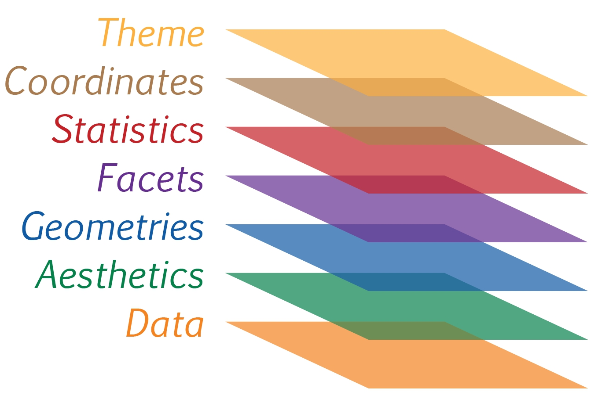

## 1.1 Learning Outcome

In this chapter, you will learn the basic principles and essential components of ggplot2. At the same time, you will gain hands-on experience on using these components to plot statistical graphics based on the principle of Layered Grammar of Graphics. By then end of this chapter you will be able to apply the essential graphical elements provided by ggplot2 to create elegant and yet functional statistical graphics.

## 1.2 Getting started

### 1.2.1 Installing and loading the required libraries

Before we get started, it is important for us to ensure that the required R packages have been installed. If yes, we will load the R packages. If they have yet to be installed, we will install the R packages and load them onto R environment.

::: callout-note
The code chunk on the right assumes that you already have [**pacman**](https://cran.r-project.org/web/packages/pacman/index.html) package installed. If not, please go ahead install pacman first.
:::

```{r}
pacman::p_load(tidyverse)
```

### 1.2.2 Import Data

-   The code chunk below imports *exam_data.csv* into R environment by using [*read_csv()*](https://readr.tidyverse.org/reference/read_delim.html) function of [**readr**](https://readr.tidyverse.org/) package.

-   **readr** is one of the tidyverse package.

```{r}
exam_data <- read_csv("data/Exam_data.csv")
```

-   Year end examination grades of a cohort of primary 3 students from a local school.

-   There are a total of seven attributes. Four of them are categorical data type and the other three are in continuous data type.

    -   The categorical attributes are: ID, CLASS, GENDER and RACE.

    -   The continuous attributes are: MATHS, ENGLISH and SCIENCE.

## 1.3 Introducing ggplot

{width="50px"}

[ggplot2](https://ggplot2.tidyverse.org/) is an R package for **declaratively** creating **data-driven** graphics based on ***The Grammar of Graphics***. It is also part of the tidyverse family specially designed for visual exploration and communication.

### 1.3.1 R Graphics VS ggplot

First, let us compare how R Graphics, the core graphical functions of Base R and ggplot plot a simple histogram.

::: panel-tabset
### R Graphics

```{r}
hist(exam_data$MATHS)
```

### ggplot2

```{r}
ggplot(data=exam_data, aes(x = MATHS)) +
  geom_histogram(bins=10, 
                 boundary = 100,
                 color="black", 
                 fill="grey") +
  ggtitle("Distribution of Maths scores")
```
:::

As you can see that the code chunk is relatively simple if R Graphics is used. Then, the question is why ggplot2 is recommended?

As pointed out by [Hadley Wickham](http://varianceexplained.org/r/teach_ggplot2_to_beginners/#comment-1745406157)

::: callout-important
The transferable skills from ggplot2 are not the idiosyncrasies of plotting syntax, but a powerful way of thinking about visualisation, as a way of mapping between variables and the visual properties of geometric objects that you can perceive.
:::

## 1.4 Grammar of Graphics

Before we getting started using ggplot2, it is important for us to understand the principles of Grammer of Graphics.

Grammar of Graphics is a general scheme for data visualization which breaks up graphs into semantic components such as scales and layers. It was introduced by Leland Wilkinson (1999) **Grammar of Graphics**, Springer. The grammar of graphics is an answer to a question:

::: text-center
What is a statistical graphic?
:::

In the nutshell, Grammar of Graphics defines the rules of structuring mathematical and aesthetic elements into a meaningful graph.

There are two principles in Grammar of Graphics, they are:

-   Graphics = distinct layers of grammatical elements

-   Meaningful plots through aesthetic mapping

A good grammar of graphics will allow us to gain insight into the composition of complicated graphics, and reveal unexpected connections between seemingly different graphics (Cox 1978). It also provides a strong foundation for understanding a diverse range of graphics. Furthermore, it may also help guide us on what a well-formed or correct graphic looks like, but there will still be many grammatically correct but nonsensical graphics.

### 1.4.1 A Layered Grammar of Graphics

ggplot2 is an implementation of Leland Wilkinson’s Grammar of Graphics. Figure below shows the seven grammars of ggplot2.



Reference: Hadley Wickham (2010) [“A layered grammar of graphics.”](https://vita.had.co.nz/papers/layered-grammar.html) *Journal of Computational and Graphical Statistics*, vol. 19, no. 1, pp. 3–28.

A short description of each building block are as follows:

-   **Data**: The dataset being plotted.

-   **Aesthetics** take attributes of the data and use them to influence visual characteristics, such as position, colours, size, shape, or transparency.

-   **Geometrics**: The visual elements used for our data, such as point, bar or line.

-   **Facets** split the data into subsets to create multiple variations of the same graph (paneling, multiple plots).

-   **Statistics**, statiscal transformations that summarise data (e.g. mean, confidence intervals).

-   **Coordinate systems** define the plane on which data are mapped on the graphic.

-   **Themes** modify all non-data components of a plot, such as main title, sub-title, y-aixs title, or legend background.

## 1.5 Essential Grammatical Elements in ggplot2: data

Let us call the `ggplot()` function using the code chunk on the right.

```{r}
ggplot(data=exam_data)
```

::: callout-note
-   A blank canvas appears.
-   `ggplot()` initializes a ggplot object.
-   The *data* argument defines the dataset to be used for plotting.
-   If the dataset is not already a data.frame, it will be converted to one by `fortify()`.
:::
