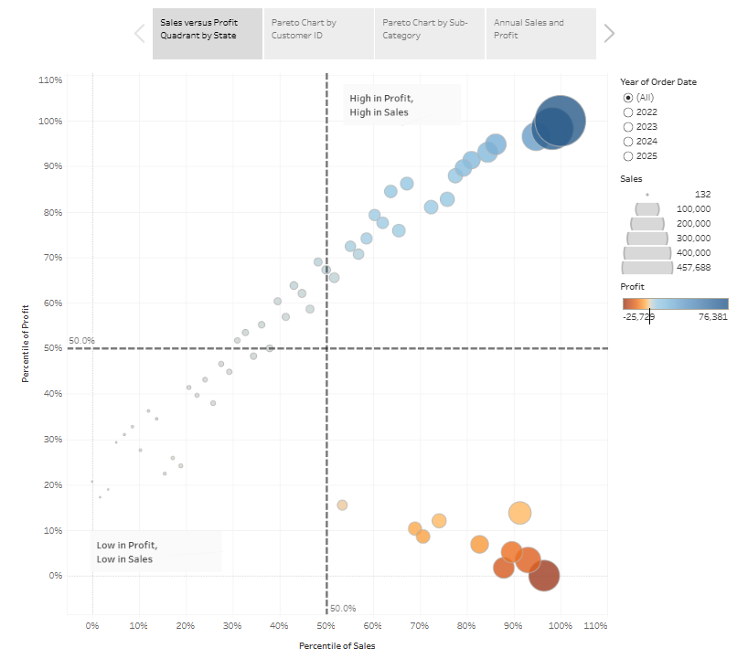
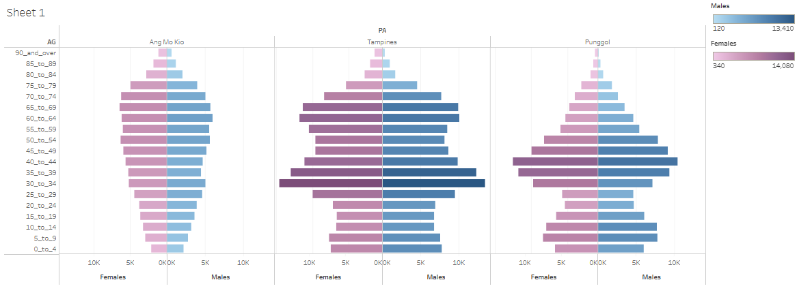

[Exercise 3a](https://public.tableau.com/app/profile/wee.tian.chua/viz/Book2_17777069687130/Story1?publish=yes)

[{width="430"}](https://public.tableau.com/app/profile/wee.tian.chua/viz/Book2_17777069687130/Story1?publish=yes)

[Exercise 3b](https://public.tableau.com/app/profile/wee.tian.chua/viz/Book2b_17777069060610/Sheet1?publish=yes)

[{width="430"}](https://public.tableau.com/app/profile/wee.tian.chua/viz/Book2b_17777069060610/Sheet1?publish=yes)
