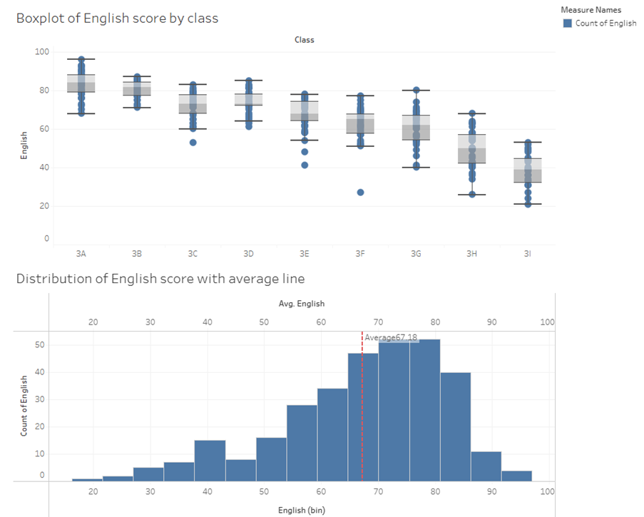
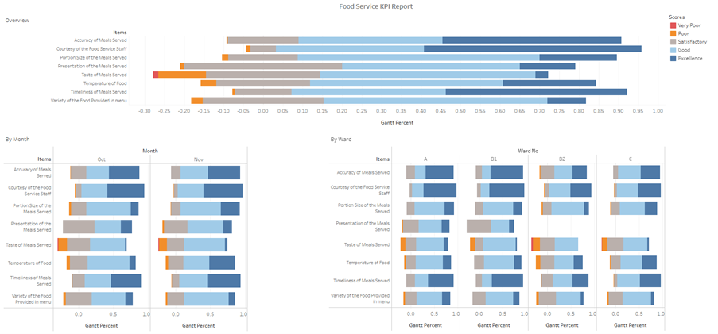

[Exercise 4a](https://public.tableau.com/app/profile/wee.tian.chua/viz/InClassEx4showmethestatistics/Dashboard1)

[{width="430"}](https://public.tableau.com/app/profile/wee.tian.chua/viz/InClassEx4showmethestatistics/Dashboard1)

[Exercise 4b](https://public.tableau.com/app/profile/wee.tian.chua/viz/InClassEx4divergingstackbarchart/Dashboard1?publish=yes)

[{width="430"}](https://public.tableau.com/app/profile/wee.tian.chua/viz/InClassEx4divergingstackbarchart/Dashboard1?publish=yes)
